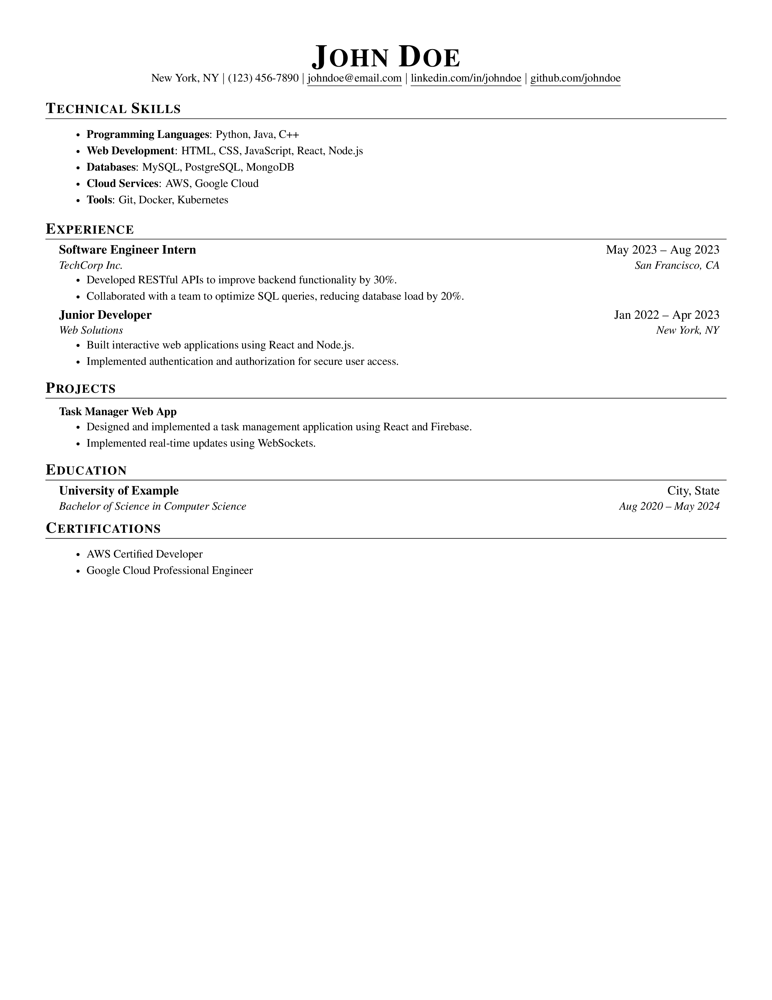

# LaTeX Resume Template

A clean and professional **LaTeX** template for crafting your resume effortlessly.

**Inspired by:** [Jake's Resume](https://www.overleaf.com/latex/templates/jakes-resume/syzfjbzwjncs)

## Template Features

- 🖋 **Font:** Times New Roman (10pt)
- 📏 **Margins:** 0.5 inches on all sides
- ⚡ **Optimized for ATS (Applicant Tracking Systems)**

## How to Use

1. **Compile & Edit:** Upload the `.tex` file to [Overleaf](https://www.overleaf.com/) for easy compilation and editing.
2. **Quick AI Conversion:**
   - Have an existing resume? Use **ChatGPT, Gemini, or Claude** to convert it into this LaTeX format.
   - **Before sharing, remove personal contact details** for privacy.
   - Upload the generated LaTeX file to Overleaf and make final tweaks.

## Customization

- Modify sections like **Education, Experience, Skills, and Projects** directly in the `.tex` file.
- Adjust layout and styling with simple LaTeX commands.

## Preview

🚀 **Happy LaTeX-ing!**
